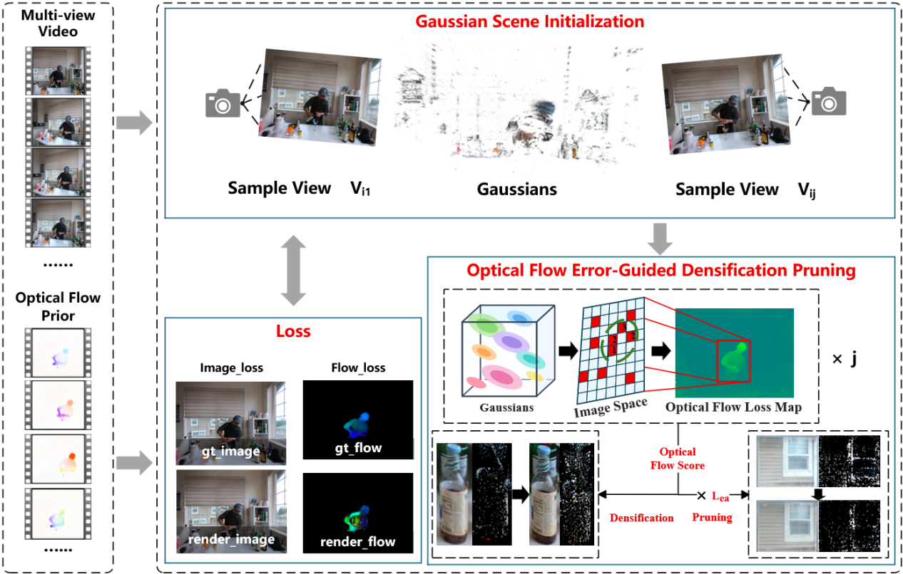
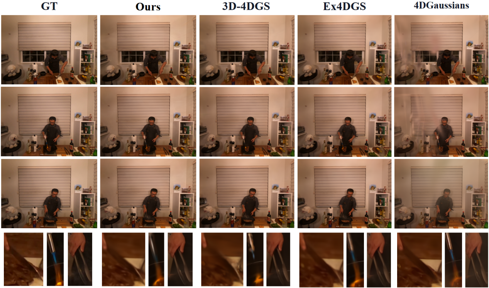
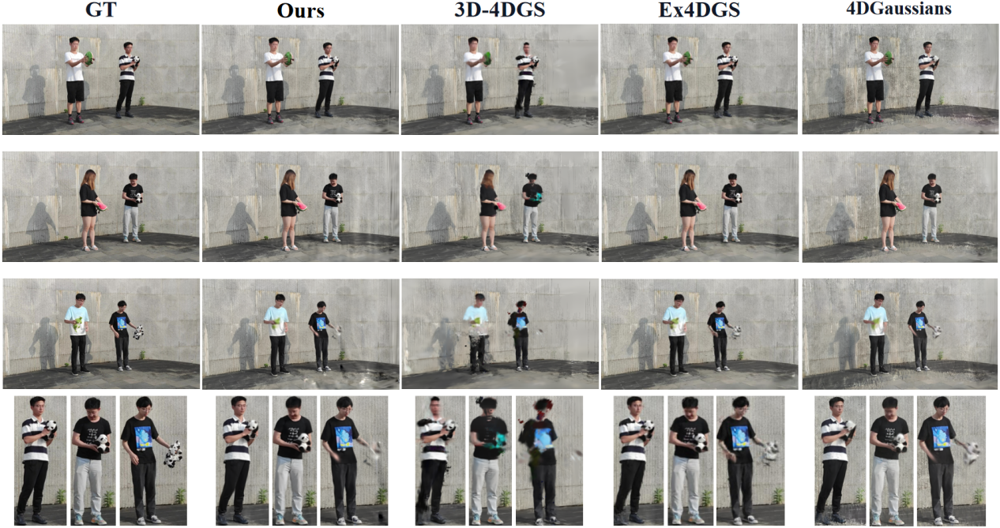

# TCC4DGS: Fast 4D Gaussian Splatting Reconstruction under Temporal Consistency Constraints

Official project page for **TCC4DGS**.

## 📌 Abstract

Fast 4D Gaussian Splatting (4DGS) reconstruction must balance compact Gaussian representations, short training times, and stable cross-frame motion modeling. In dynamic scenes, occlusion, motion blur, and transient appearance changes can corrupt frame-wise supervision, causing redundant densification, erroneous pruning, and temporal artifacts such as ghosting and flicker. We present **TCC4DGS**, a fast 4DGS reconstruction framework constrained by temporal consistency. The framework evaluates cross-frame motion consistency using optical-flow errors between adjacent frames. Gaussians that persistently cover high-temporal-error regions are selected as densification candidates, while a pruning score combines the flow reconstruction error with an edge-aware smoothness term. Specifically, we first compute the cross-frame discrepancy between rendered and prior optical flow and normalize it to identify high-temporal-error regions. We then jointly gate per-Gaussian temporal-error scores and image-space gradients so that cloning or splitting is performed only in persistently under-reconstructed regions. Candidate Gaussians are subsequently evaluated using the flow reconstruction error and edge-aware smoothness term to remove redundant primitives that consistently induce temporal inconsistency while preserving genuine motion boundaries. Throughout training, adjacent frames from the same viewpoint are rasterized once each to obtain rendered optical flow efficiently, thereby limiting the additional cost of temporal supervision. Experiments on Neural 3D Video and ENeRF-Outdoor show that our method maintains or improves reconstruction quality while reducing the size of the trained Gaussian point-cloud model and accelerating training. TCC4DGS thus provides a unified solution for efficient and temporally stable dynamic-scene reconstruction.

Our contributions include:

- A general framework that can be integrated with diverse 3DGS backbones and achieves a better balance among training time, model size, reconstruction quality, and temporal stability.
- A temporal-consistency-guided densification rule that selects Gaussians persistently covering high-temporal-error regions as candidates. Cloning or splitting is performed only when both the optical-flow error and image-space gradient indicate under-reconstruction.
- A pruning score that combines the flow reconstruction error with an edge-aware smoothness term, preferentially removing redundant Gaussians that consistently cause temporal inconsistency without excessively penalizing genuine motion boundaries.
- An improved Gaussian rasterization pipeline that processes adjacent frames from the same viewpoint once each, efficiently producing rendered images and optical flow in CUDA while concurrently accumulating per-Gaussian error statistics.

## 🏗️ Pipeline Overview

  
  
<i>Fig. 1. Overview of TCC4DGS. (1) Multiview videos are used to initialize a Gaussian scene representation with time-varying primitives. We first sample <i>j</i> viewpoints and then select the same frame <i>i</i> for each sampled viewpoint. (2) The optical-flow error is normalized into an error map. A high-error mask is generated using the flow-error threshold τflow, and error statistics are accumulated across the <i>j</i> sampled views to obtain the Optical Flow Score. (3) High-temporal-error Gaussians and image gradients jointly determine densification candidates. The flow reconstruction error is combined with Lea to form the pruning score, where Lea denotes an edge-aware smoothness term controlled by the edge-weight and smoothing coefficients. (4) Adjacent frames from the same viewpoint are rasterized once each to obtain rendered optical flow efficiently. Imageloss and Flowloss jointly update the time-varying Gaussian parameters.</i>

## 📊 Qualitative Results

   
  

## 🎬 Demo Videos

### Indoor Scene Reconstruction Demos

  <video src="./demo/cut_roasted_beef.mp4" controls muted loop playsinline width="100%"></video>
  
  
<i>Cut Roasted Beef Scene — <a href="./demo/cut_roasted_beef.mp4">Download High-Quality MP4</a></i>

  <video src="./demo/flame_steak.mp4" controls muted loop playsinline width="100%"></video>
  
  
<i>Flame Steak Scene — <a href="./demo/flame_steak.mp4">Download High-Quality MP4</a></i>

  <video src="./demo/sear_steak.mp4" controls muted loop playsinline width="100%"></video>
  
  
<i>Sear Steak Scene — <a href="./demo/sear_steak.mp4">Download High-Quality MP4</a></i>

---

### Outdoor Scene Reconstruction Demos

  <video src="./demo/actor1_4.mp4" controls muted loop playsinline width="100%"></video>
  
  
<i>Actor 1_4 Scene — <a href="./demo/actor1_4.mp4">Download High-Quality MP4</a></i>

  <video src="./demo/actor2_3.mp4" controls muted loop playsinline width="100%"></video>
  
  
<i>Actor 2_3 Scene — <a href="./demo/actor2_3.mp4">Download High-Quality MP4</a></i>

  <video src="./demo/actor5_6.mp4" controls muted loop playsinline width="100%"></video>
  
  
<i>Actor 5_6 Scene — <a href="./demo/actor5_6.mp4">Download High-Quality MP4</a></i>

## 🚧 Code Release

The full code will be released **upon paper acceptance**.

Contact information will be provided with the public release.
